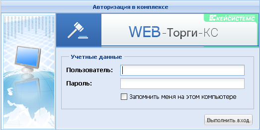
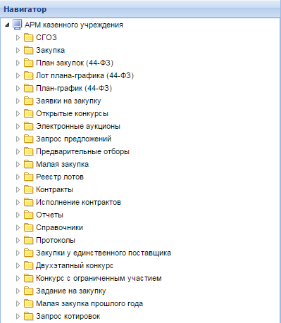

Для входа в систему заказчик должен перейти на страницу авторизации в Системе «WEB-Торги-КС» [(Рисунок 7)](#ris-07). 
! В каждом регионе используется своя страница авторизации, поэтому заказчики **из одного региона** не смогут авторизоваться **на сайте другого региона** и работать в Системе. 

 

В результате успешного перехода загрузится страница, на которой заказчику будет предложено ввести логин и пароль для входа в Систему.

В случае успешного ввода данных идентификации пользователя предоставляется доступ к автоматизированному рабочему месту (АРМ) заказчика госзаказа [(Рисунок 8)](#ris-08), посредством которого осуществляется навигация по документам размещения заказа для данного пользователя.

  