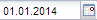
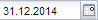

Параметры отбора документов (начало периода и конец периода) задаются в форме изменения периода обработки документов [(*Рисунок 1*)](#ris-1), которая вызывается по кнопке **«Период обработки документов»** [(*Рисунок 2*)](#ris-2).

Настройку расчетной даты и периода отбора документов можно скорректировать в элементах управления «**Расчетная дата**  {.inline .vertical-align-middle}» и «**Период от**  {.inline .vertical-align-middle}  **до**  {.inline .vertical-align-middle}», которые находятся в правом верхнем углу личного кабинета пользователя в Системе «WEB-Торги-КС» [(*Рисунок 3*)](#ris-3).

