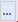

Для добавления нового значения в справочник МНН необходимо в навигаторе перейти в папку **«Справочники»** - **«Справочники МНН»** и нажать кнопку {.inline .vertical-align-middle}**[Создать]** *[(Рисунок 1)](#ris-01)*.
 

В результате чего откроется форма ввода нового наименования в справочник МНН *[(Рисунок 2)](#ris-02)*.
 

!!! Поля: **«Код МНН»**, **«Код МНН в ИАС»**, **«Уникальный код МНН»**, **«Уникальный внешний код»** не заполняются при ручном вводе. Данные поля заполнены только для справочных значений, загруженных из ЕИС.

В открывшейся форме необходимо выполнить ввод данных в поля **«Наименование»**, **«Наименование лекарственной формы»**. Поле **«Код ОКПД2»** заполняется по нажатию кнопки {.inline .vertical-align-middle}*[(Рисунок 2)](#ris-02)* выбором записи из справочника **«Номенклатура ОКПД2»** *[(Рисунок 3)](#ris-03)*.

Данный справочник ограничен кодами ОКПД2 в разрезе лекарственных препаратов по следующим маскам:
* 21.10.51 – групповое наименование «Провитамины, витамины и их производные»;
* 21.20.10 – групповое наименование «Препараты лекарственные»;
* 21.20.21 – групповое наименование «Сыворотки и вакцины»;
* 21.20.23 – групповое наименование «Реагенты диагностические и прочие фармацевтические препараты».

После выбора кода ОКПД2 из справочника, доступны для установки флаги: 
* Признак включения в реестр ЖНВЛП - указывает на то, что препарат является ЖНВЛП (жизненно-необходимым важнейшим лекарственным препаратом) и включен в реестр ЖНВЛП;
* Наркотические средства, психотропные вещества и их прекурсоры – указывает на то, что препарат является наркотическим, психотропным веществом или их прекурсором;
* Актуальность – признак актуальности/не актуальности данного препарата - проставление данного флага влияет на отображение данной записи справочника МНН при заполнении документа.

Информация на вкладке **«Анатомо-терапевтически-химические классификации (АТХ)»** недоступна для ручного ввода и заполняется только для справочников, загруженных из ЕИС.
Вкладка **«Дозировка»** содержит информацию о дозировке препарата. Информация в табличную часть вкладки вводится путем нажатия кнопки {.inline .vertical-align-middle}**[Добавить строку]** *[(Рисунок 4)](#ris-04)*.
 

В новой строке необходимо ввести полную форму дозировки и выбрать потребительскую единицу дозировки из справочника единиц измерений.
По окончании ввод всех данных, необходимо нажать кнопку {.inline .vertical-align-middle}**[Сохранить]**. Сохраняемая форма пройдет ряд контролей на корректность заполнения. В случае отсутствия ошибок – форма успешно сохранится. В случае обнаружения недочетов – будет выдан протокол с указанием ошибок *[(Рисунок 5)](#ris-05)*.
