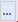

При проведении закупок лекарственных препаратов, в случае отсутствия необходимого лекарственного препарата в справочнике ТН, предусмотрена возможность ручного ввода данных в справочник ТН. Справочник может заполняться как администраторами системы, так и самим заказчиком, в зависимости от настроек на регионе. 
Для ввода новой записи в справочник ТН, необходимо в меню навигатора перейти в папку **«Справочники»** - **«Справочники ТН»** и нажать кнопку {.inline .vertical-align-middle}**[Создать]** *[(Рисунок 1)](#ris-01)*.
 

В результате откроется форма ввода новой записи в справочник ТН *[(Рисунок 2)](#ris-02)*.
 

В открывшейся форме необходимо заполнить поля **«Торговое наименование (ТН) лекарственного препарата»**, **«Лекарственная форма»**, проставить флаг актуальности записи - проставление данного флага влияет на отображение данной записи справочника ТН при заполнении документа.
Во вкладке **«МНН»** в блоке **«Международное, группировочное или химическое наименование лекарственного препарата (МНН)»** заполняется поле **«Наименование»** выбором из справочника МНН, который вызывается по нажатию кнопки {.inline .vertical-align-middle}*[(Рисунок 2)](#ris-02)*, причем в данном справочнике будет отражаться только та информация, которая была введена в **«Справочник МНН»** вручную администратором или пользователем системы *[(Рисунок 3)](#ris-03)*.
 

Во вкладке **«Держатель или владелец РУ»** необходимо заполнить следующие поля:
* Наименование держателя или владельца (разработчик лекарственного средства, производитель лекарственных средств или иное юридическое лицо, обладающее правом владения регистрационным удостоверением, которые несут ответственность за качество, эффективность и безопасность лекарственного препарата;
* Номер регистрационного удостоверения (номер удостоверения производителя или разработчика лекарственных средств)*[(Рисунок 4)](#ris-04)*. 

Во Вкладке **«Производитель»** в блок полей **«Производитель ЛП»** вводится информация о производителе лекарственного препарата *[(Рисунок 5)](#ris-05)*:
* Страна, классификация по ОКСМ - заполняется выбором страны производителя из справочника **«Общероссийский классификатор стран мира»**, который вызывается по нажатию кнопки {.inline .vertical-align-middle}*[(Рисунок 6)](#ris-06)*;
* Наименование производителя.
 
 

Во вкладке **«Упаковка»** в блоке **«Сведения об упаковке»** содержится информация об упаковке *[(Рисунок 7)](#ris-07)*:
* Наименование вида первичной упаковки - заполняется выбором из справочника **«Сведения об упаковке»**, который вызывается нажатием кнопки {.inline .vertical-align-middle}*[(Рисунок 8)](#ris-08)*;
* Количество лекарственных форм в первичной упаковке;
* Количество первичных упаковок во вторичной (потребительской) упаковке;
* Комплектность упаковки.
 
 

Во вкладке **«Дозировка»**, в блоке полей **«Дозировка»** указывается **«Значение дозировки»**, поля **«Наименование единицы измерения дозировки»** и **«Единица измерения дозировки (классификатор ОКЕИ)»** не обязательны для заполнения *[(Рисунок 9)](#ris-09)*.
 

По окончании ввода всех данных, необходимо нажать кнопку {.inline .vertical-align-middle}[**Сохранить**]. Сохраняемая форма пройдет ряд контролей на корректность заполнения. В случае отсутствия ошибок – форма успешно сохранится. В случае обнаружения недочетов – будет выдано уведомление с указанием ошибок.