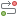

Следующим документом, который должен сформировать заказчик, является документ «**Заявка на закупку**». В зависимости от региона Заявка на закупку создается либо по кнопке {.inline .vertical-align-middle} [**Создать**], либо исходя из подгруженной Предварительной заявки на закупку с базы *Бюджет*  (см. п. [*2.6.2*](/complex-operations/2-6-formirovanie-zayavok-na-razmesheniya-zakaza/formirovanie-predvaritelnykh-zayavok) данного руководства). Ниже будет рассмотрен первый вариант.

Заказчику необходимо в Навигаторе перейти к документу «**Заявка на закупку**», фильтр «**Создание новой**» и нажать кнопку {.inline .vertical-align-middle} [**Создать**] *[(Рисунок 1)](#ris-01)*.

В открывшейся электронной форме Заявки на закупку нужно выбрать необходимую Позицию план-графика из справочника «**Справочника позиций план-графика**» *[(Рисунок 2)](#ris-02)*.

Все данные из Позиции плана-графика подтянутся в Заявку на закупку.

После выбора Позиции плана-графика во вкладке «**Дополнительные сведения**», в блоке «**Сведения о проведении совместных торгов**», в поле «**Предусматривается проведение совместных торгов**» установится значение «**ДА**» и значение в поле «**Инициатор совместных торгов**» *[(Рисунок 3)](#ris-03)*.

Обязательность заполнения поля «**Заявка о проведении совместных закупок**» настраивается индивидуально для каждого региона. В случае если в Позиции плана-графика не была выбрана Планируемая сводная в поле «**Заявка о проведении совместных закупок**», то её можно выбрать на этапе Заявки на закупку. Поле «**Заявка о проведении совместных закупок**» заполняется путем выбора номера Планируемой сводной заявки на закупку из Справочника «**Реестр предстоящих извещений о проведении совместных закупок**» *[(Рисунок 4)](#ris-04)*.

Если Планируемая сводная заявка на закупку первоначально была указана в Позиции плана-графика, то при выборе Позиции в Заявке на закупку данное значение установится в поле ««**Заявка о проведении совместных закупок**».

После выбора Планируемой сводной в поле «**Заявка о проведении совместных закупок**» вся информация из данной Планируемой сводной подтянется в Заявку на закупку и будет не доступна для редактирования *[(Рисунок 5)](#ris-05)*.

То же самое произойдет, если при выборе Позиции плана-графика во вкладке «**Товары, работы, услуги**» выбрать Позицию, в которой указан номер Планируемой сводной заявки на закупку. При этом номер Планируемой сводной появится в поле «**Заявка о проведении совместных закупок**» *[(Рисунок 6)](#ris-06)*.

Во вкладке «**Товары, работы, услуги**» заказчику необходимо отредактировать количество. Например, если в Планируемой заявке было указано больше строк продукции чем необходимо заказчику, то лишние строки нужно удалить.

Вкладки «**Финансирование**», «**Условия обеспечения**», «**Условия контракта**» и «**Комиссия**» заполняются по необходимости.

Вкладка «**Информация о документации и критериях**» активна только в том случае, если способ определения поставщика в заявке – Конкурс.

Все недостающие сведения в Заявке на закупку заполняются аналогично тому, как в см. п. [*2.6.3*](/complex-operations/2-6-formirovanie-zayavok-na-razmesheniya-zakaza/formirovanie-dokumenta-zayavka-na-zakupku) данного руководства пользователя. Затем данные необходимо сохранить по кнопке {.inline .vertical-align-middle} [**Сохранить**]. После сохранения, поля которые подтянулись из Планируемой сводной заявки останутся так же, недоступны для изменения.

Когда Заявка на закупку будет полностью заполнена и сохранена, ее следует отправить на согласование по кнопке {.inline .vertical-align-middle} [**Отправить по маршруту**]. Подробное описание процедуры согласования Заявки на закупку отражено в п. [*2.6.8*](/complex-operations/2-6-formirovanie-zayavok-na-razmesheniya-zakaza/soglasovanie-zayavok-na-zakupku) данного руководства.

Как только Заявка на закупку будет принята к исполнению, Инициатор совместных торгов сможет подгрузить ее в Сводную заявку по кнопке {.inline .vertical-align-middle} [**Подгрузить сведения**] *[(Рисунок 7)](#ris-07)*.

В случае обнаружения неточностей Инициатор может вернуть документ заказчику на доработку, предварительно исключив Заявку на закупку из Сводной. Заказчик же, со своей стороны, должен устранить неточности и повторно отправить документ на согласование Инициатору совместных торгов.