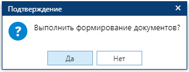
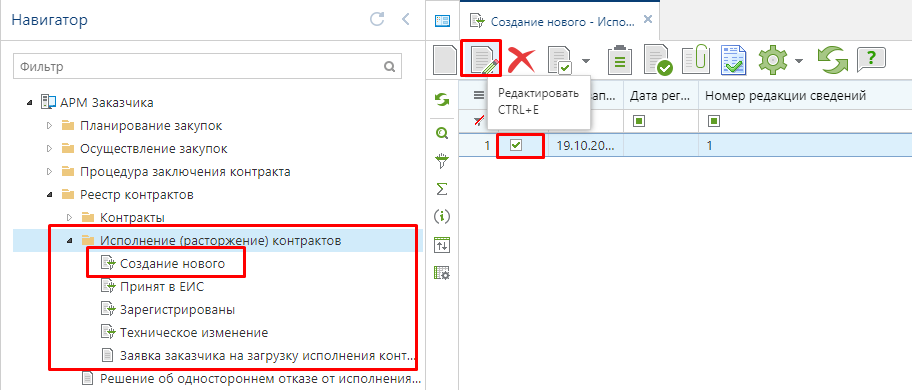
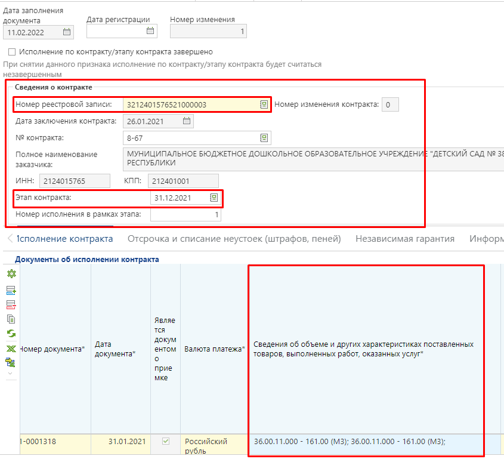
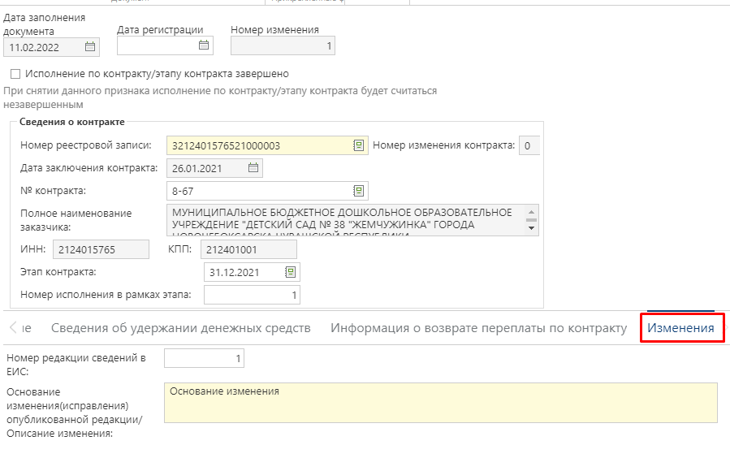

Для внесения изменения в ранее размещенное в ЕИС Исполнение контракта надо в навигаторе в папке «**Исполнение контракта**» открыть фильтр «**Зарегистрированы**», выделить из списка требуемый документ и нажать кнопку {.inline .vertical-align-middle} **[Сформировать изменение]** *[(Рисунок 1)](#ris-1)*.

В окне подтверждения действия для продолжения процедуры формирования изменения надо нажать кнопку **[ДА]** *[(Рисунок 2)](#ris-2)*.

По результатам выполнения операции по формированию изменения документы Система отобразит протокол о невозможности формирования изменения с отображением причин или же отобразить протокол успешного формирования изменения документа *[(Рисунок 3)](#ris-3)*. По клику ЛКМ на гиперссылку с номером изменения в протоколе можно открыть сформированный документ.

Вновь сформированный документ будет доступен в папке Навигатора «**Исполнение контракта**» в фильтре «**Создание нового**». Для открытия вновь сформированного документа необходимо его выделить в списке и нажать кнопку {.inline .vertical-align-middle} **[Редактировать]** *[(Рисунок 4)](#ris-4)* или движды кликнуть по записи в списке ЛКМ.

В момент формирования изменения исполнения контракта происходит автоматическая связка изменения исполнения контракта с последней актуальной редакцией зарегистрированного в ЕИС контракта *[(Рисунок 5)](#ris-5)*.

Значение в поле «**Этап контракта**» автоматически обновляется на основе данных из последней актуальной редакции контракта на основе соответствия данных по идентификатору этапу контракта или по дате начала исполнения этапа контракта. Если ни по одному из этих параметров соответствие не будет найдено в актуальной редакции контракта, то значение этапа контракта останется неизменным. Так же в изменении исполнения контракта для заказчиков доступна возможности ручного выбора этапа контракта. Чтобы избежать перемешивания различных редакций исполнения контракта в рамках этапов контракта предусмотрен системный блокирующий контроль, проверяющий корректность выбора этапа контракта. Данный контроль не сработает для пользователей с ролью администратора Системы.

Так же в момент формирования изменения исполнения контракта автоматически обновляются сведения об объеме исполненных обязательств поставщиком в связке с актуальной редакцией контракта.

Во вкладке «**Изменение**» надо заполнить поля «**Номер редакции сведений в ЕИС», «Основание изменения (исправления) опубликованной редакции/ Описание изменения**» *[(Рисунок 6)](#ris-6)*.

После внесения необходимых изменений в сведения об исполнения контракта надо нажать кнопку {.inline .vertical-align-middle} **[Сохранить]**.