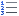

Для формирования новой позиции РКТРУ необходимо в Навигаторе перейти к папке «**Позиция каталога ТРУ**» и открыть фильтр «**Создание новой позиции**» *[(Рисунок 1)](#ris-01)*. В открывшемся списке на панели инструментов необходимо нажать кнопку {.inline .vertical-align-middle}**[Создать]**.
 

В открывшейся экранной форме позиции каталога необходимо выбрать «**Тип**» объекта закупки и выбрать группу позиции каталога из справочника «**Cправочник групп позиций каталога**» *[(Рисунок 2)](#ris-02)*.
 

В шапке документа необходимо заполнить поля «**Наименование товара, работы, услуги**», «**Краткое описание**», выбрать код ОКПД2, единицу измерения *[(Рисунок 3)](#ris-03)*. По «Наименование НКМИ» заполняется выбором значения из одноименного справочника в случае формирования позиции РКТРУ по медицинским изделиям. Во вкладке «**Основные данные**» надо заполнить поле «**Функциональные, технические, качественные характеристики, эксплуатационные характеристики**». Если позиция создается в связке с КТРУ ЕИС, то в данном поле можно заполнить прочерк.
 

В блоке полей «**Блок цен**» серые поля заполняются автоматически на основе расчетов по проведенным закупкам с использования указанной позиции каталога. Поле «**Контрольная цена**» позволяет указать цену, выше которой заказчикам будет запрещено осуществлять закупку.

Во вкладке  «**Техническое задание**», при необходимости, можно добавить набор тегов со значениями, которые будут использованы при автоматической генерации технического задания в заявке на закупку. Для добавления нового значения необходимо нажать кнопку {.inline .vertical-align-middle}[**Добавить строку**] и в появившейся строке дважды кликнуть в поле [**Наименование показателя ТК**] *[(Рисунок 4)](#ris-04)*.
 

В открывшемся справочнике «**Справочник наименований показателей ТЗ**» необходимо выбрать требуемое значение и нажать кнопку [**Применить**].

!!! Справочник наименований показателей ТЗ доступен для самостоятельного заполнения данными администраторам Системы. Добавление происходит без привлечения разработчиков Системы.

Для каждого наименования показателя ТЗ доступны для заполнения следующие поля: «**Единица измерения показателя**» из справочника единиц измерений, «**Значение**», «**Тип показателя**» и «**Нормативный документ, на основании которого установлено требование к показателю**».

Во вкладке «**Шаблоны**» для определенных типов шаблонов возможно назначение шаблона документации, которая будет генерироваться Системой автоматически [(*Рисунок 5*)](#ris-05). В поле «**Наименование шаблона**» назначается шаблоне для генерации единичных закупок. В «**Наименование шаблона (для сводной)** » назначается шаблон для генерации в сводных заявках на закупку.
 

!!! Шаблоны также можно назначить на группу позиции РКТРУ. В этом случае не будет необходимости в назначении шаблона для каждой позиции. Если для позиции будет определен свой шаблон, отличный от шаблона группы позиции, то при генерации документации будет использован шаблон позиции РКТРУ. 

Во вкладке «**Видимость по корреспонденту**» доступна возможность выбора организаций заказчиков, для которых будет доступна возможность выбора данной позиции РКТРУ *[(Рисунок 6)](#ris-06)*. Для организаций, не отмеченных в данных в данной вкладке, создаваемая позиция РКТРУ не будет доступна для использования.
 

Во вкладке «**Характеристики и КТРУ**» доступна возможность связки позиции регионального каталога с КТРУ ЕИС. Для этого в поле «**Код каталога продукции**» необходимо из справочника «**Справочник позиций каталога ЕИС**» выбрать требуемую позицию для связи *[(Рисунок 7)](#ris-07)*.
 

Далее необходимо на панели инструментов таблицы характеристик КТРУ нажать кнопку {.inline .vertical-align-middle}[**Подгрузить сведения**]. Для характеристик с множественным значением требуется по двойному клику в поле «**Характеристика**» открыть экранную форму «**Сведений о характеристике**» *[(Рисунок 8)](#ris-08)*. В открывшейся экранной форме в поле «**Возможные значения характеристики**» выбрать значение характеристики из справочника «**Справочник значений характеристики**» и нажать кнопку {.inline .vertical-align-middle} [**Сохранить**].

Значения характеристик, имеющих множество вариантов значений, можно заполнить выбором доступных значений. Для этого надо дважды кликнуть в поле «**Возможные значения характеристики**» *[(Рисунок 9)](#ris-09)*.

Процедуру заполнения значения характеристик необходимо повторить для всех записей, требующих выбора значения.

Начиная с выхода версии ЕИС 13.3 во вкладке «**Характеристики и КТРУ**» доступна возможность заполнения структурированных характеристик в отношении объекта закупки без применения КТРУ ЕИС *[(Рисунок 10)](#ris-10)*. Для добавления характеристик на панели инструментов таблицы надо нажать кнопку {.inline .vertical-align-middle} [**Подгрузить сведения из справочника ручных характеристик**].

В открывшемся окне ручных характеристик надо отметить требуемые характеристики и нажать кнопку [**Применить**] *[(Рисунок 11)](#ris-11)*. Список доступных для выбора характеристик фильтруется по ОКПД2, указанному форму ввода позиции каталога товаров, работ, услуг.

В отношении загруженных ручных характеристик необходимо указать их значения. Для этого напротив характеристики надо дважды кликнуть в поле «**Характеристика**» *[(Рисунок 12)](#ris-12)*.

В открывшейся экранной форме в зависимости от типа характеристики надо заполнить блок полей «**Качественные показатели**» или «**Количественные показатели**» [(_Рисунок 13_)](#ris-13).

Значение характеристики также можно заполнить из поля «**Возможные значения характеристики**». Список доступных значений строится на основе анализа ранее использованных значений по данной характеристике. Если характеристика ранее не использовалась в документах, то список доступных для него значений будет пуст.

!!! Если в списке характеристик введенных вручную отсутствуют требуемые значения, то их можно добавить из формы ввода сведений о характеристиках согласно описанию ниже, либо из справочника. Описание добавления новых записей в справочник характеристик введенных вручную отражено в пункте «[2.3.11 Справочник характеристик введенных вручную](/complex-operations/ispolzovanie-dostupnykh-spravochnikov/manual_char)» текущего руководства пользователя.

Для строки характеристики в поле «**Инструкция к заполнению**» необходимо указать значение из справочника «**Инструкция по заполнению характеристик в заявке**» [(_Рисунок 14_)](#ris-14).

Список возможных инструкций в зависимости от типа характеристики: 
•	Значение «_Участник закупки указывает в заявке конкретное значение характеристики_» доступно для типа объекта закупки «**Товар**» и типа характеристики «**Качественная**» или «**Количественная**» с заполненным диапазоном;
•	Значение «_Участник закупки указывает в заявке диапазон значений характеристики_» доступно для типа объекта закупки «**Товар**» и типа характеристики «**Количественная**» с указанным диапазоном;
•	Значение «_Участник закупки указывает в заявке только одно значение характеристики_» доступно для типа объекта закупки «**Товар**» и типа характеристики «**Качественная**»;
•	Значение «_Участник закупки указывает в заявке одно или несколько значений характеристики_» доступно для типа объекта закупки «**Товар**» и типа характеристики «**Качественная**», если указано более одного значения характеристики;
•	Значение «_Участник закупки указывает в заявке все значения характеристики_» доступно для качественной характеристики, если указано более одного значения характеристики;
•	Значение «_Значение характеристики не может изменяться участником закупки_» доступно для количественной и качественной характеристики, если указано только одно значение характеристики.

!!! При открытии справочника «**Инструкция по заполнению характеристик в заявке**» происходит фильтрация значений в зависимости от указанного типа закупки и типа характеристики. 

!!! Рекомендуется ознакомиться с алгоритмом работы применения инструкций по заполнению характеристик, доступного по адресу: [https://helpgznext.keysystems.ru/ru/f-a-q/demand/instrukc-po-zapolneniyu-kharakteristik](/f-a-q/demand/instrukc-po-zapolneniyu-kharakteristik).

!!! При нажатии на кнопку {.inline .vertical-align-middle} [**Пересчитать номера по порядку**] происходит пересчет по порядку в столбце «**№ п/п**».

!!! В случае выбора КТРУ ЕИС, в позиции РКТРУ поля «**Наименование товара, работы, услуги**» и «**Единица измерения**» заполняются автоматически, на основе данных из КТРУ ЕИС, и не доступны для изменения.

Во вкладке «**Дополнительная информация**» необходимо выбрать значение из выпадающего списка в поле «**Ограничение допуска отдельных видов медицинских изделий, происходящих из иностранного государства (в соответствии с Постановлением Правительства РФ №102 от 05.02.2015), применяется перечень**» *[(Рисунок 15)](#ris-15)*.

Для сохранения внесенных данных в позицию РКТРУ необходимо нажать кнопку {.inline .vertical-align-middle} [**Сохранить**]. В момент сохранения позиция автоматически получает уникальный номер позиции каталога *[(Рисунок 16](#ris-16)*. Позиции, созданные для товаров и лекарственных препаратов, начинаются с буквы «**т**». Позиции, созданные для работ, – с буквы «**р**». Позиции, созданные для услуг, – с буквы «**с**».
 